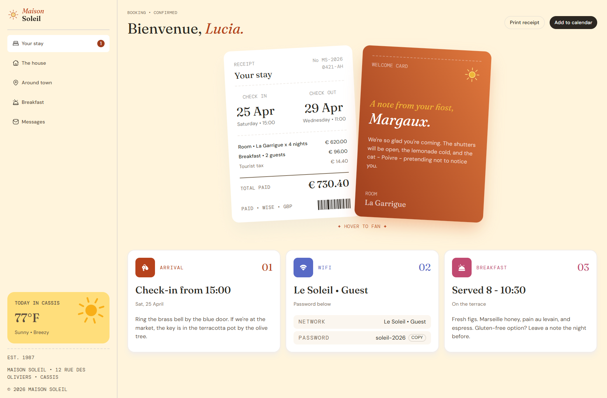

# Frontend Mentor - Hotel booking confirmation page solution

This is a solution to the [Hotel booking confirmation page challenge on Frontend Mentor](https://www.frontendmentor.io/challenges/hotel-booking-confirmation-page). Frontend Mentor challenges help you improve your coding skills by building realistic projects. 

## Table of contents

- [Overview](#overview)
  - [The challenge](#the-challenge)
  - [Screenshot](#screenshot)
  - [Links](#links)
- [Built with](#built-with)
- [Author](#author)
- [Acknowledgments](#acknowledgments)

## Overview

### The challenge

Users should be able to:

- View the optimal layout for the interface depending on their device's screen size
- See hover and focus states for all interactive elements on the page
- Open and close the navigation menu on smaller screens
- Copy the Wi-Fi password to their clipboard using the copy button

### Screenshot

### Links

- [Solution URL](https://www.frontendmentor.io/solutions/hotel-booking-confirmation-page-solution-75axAfXX8C)
- [Live Site URL](https://maisonsoleil.vercel.app/)

## Built with

## Author

* Frontend Mentor - [@codewithMycah](https://www.frontendmentor.io/profile/codewithMycah)
* GitHub - [@codewithMycah](https://github.com/codewithMycah)

## Acknowledgments

Thanks to Frontend Mentor for providing the challenge design and requirements.
